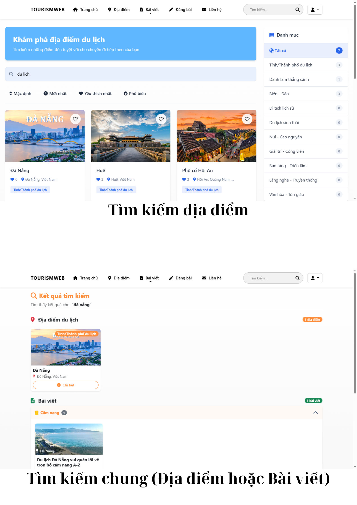
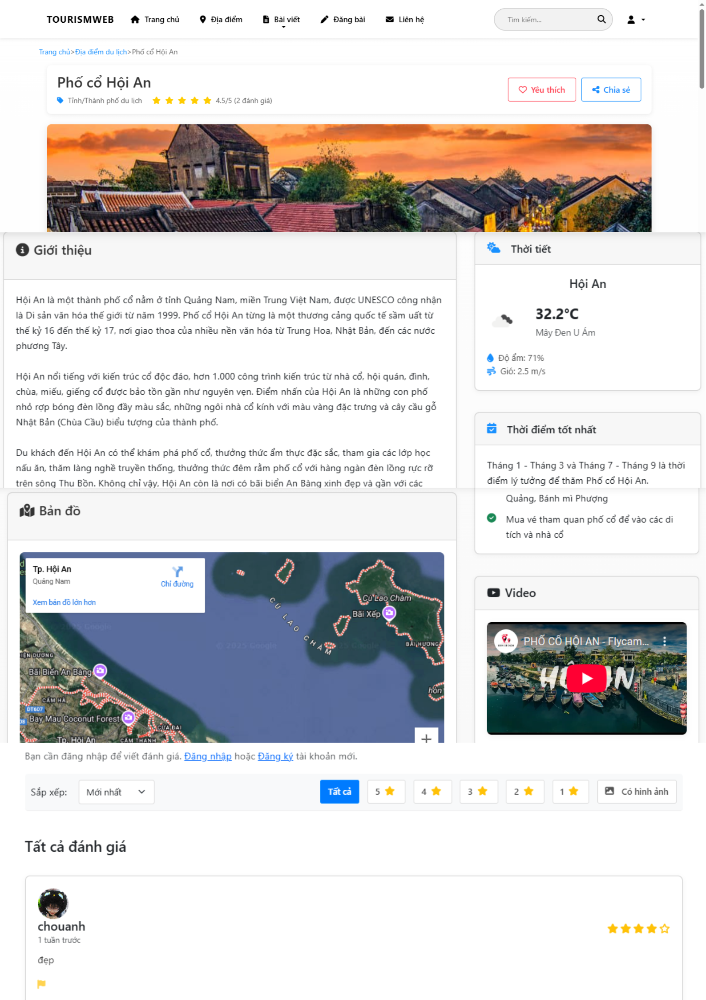
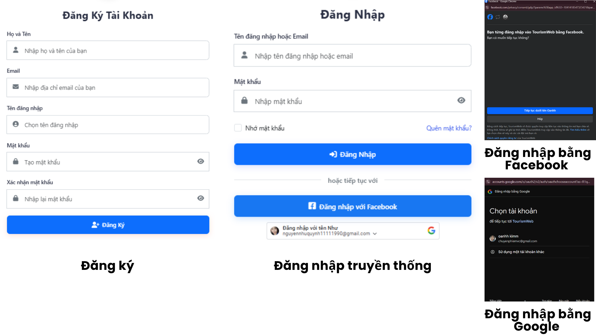
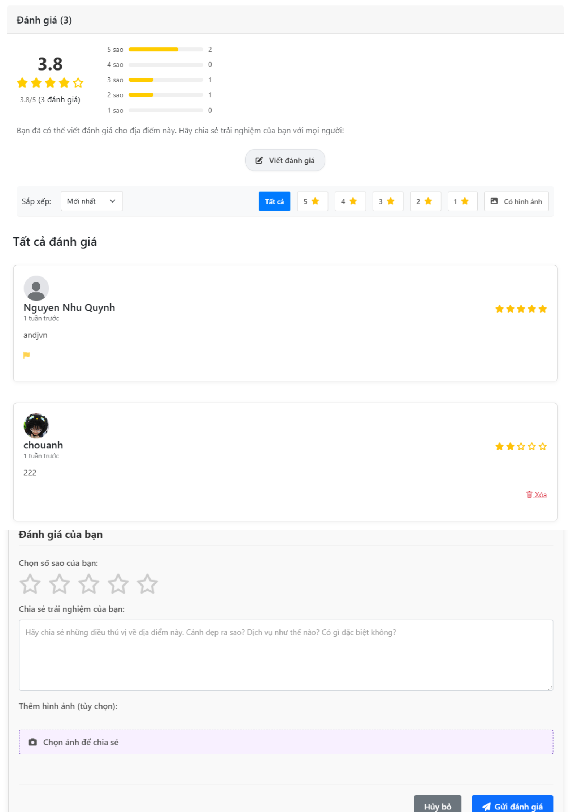
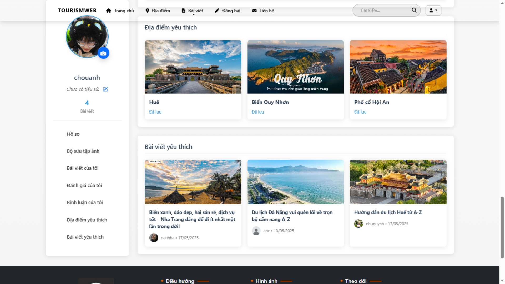
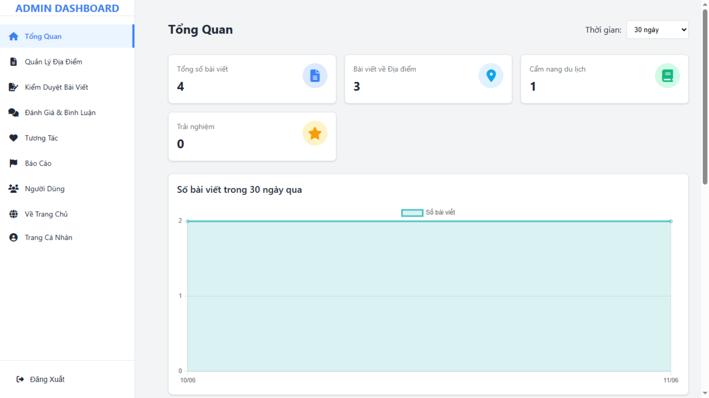
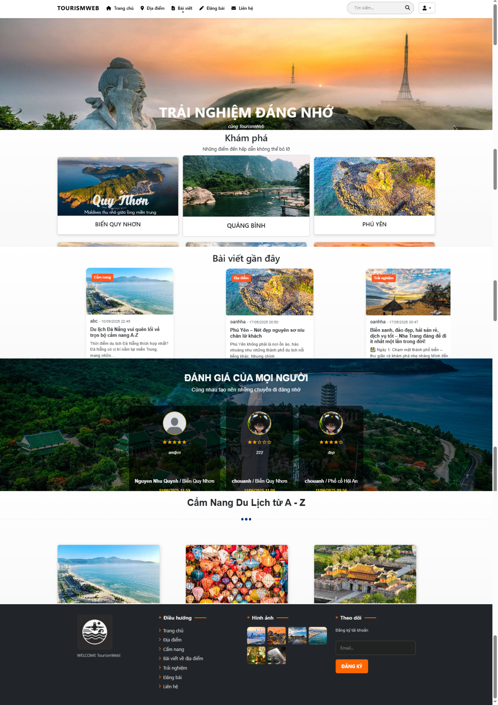
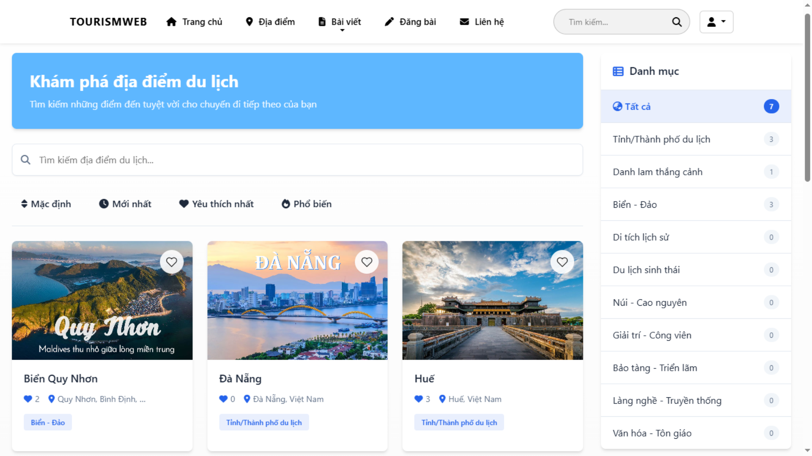

# Travel Destination Discovery Platform

A comprehensive web application that helps users discover, review, and share travel destinations. Users can explore locations, read community reviews, and share their own travel experiences through an intuitive and user-friendly interface.

## 🌟 Project Overview

This project was born from identifying a real-world problem: travelers often struggle to find suitable destinations due to scattered information, lack of transparent reviews, and inability to filter based on personal preferences. To address these challenges, I developed a full-stack web application that allows users to share experiences, provide direct reviews, and save favorite destinations.

Through building this platform, I enhanced my full-stack development skills including database design, API development, UX/UI design, and interactive functionality implementation. This project taught me the importance of understanding real user needs to build valuable and practical applications.

## 🚀 Technologies Used

### Backend
- **Language:** C#
- **Framework:** ASP.NET MVC
- **Database:** SQL Server
- **ORM:** Entity Framework

### Frontend
- **Languages:** HTML, CSS, JavaScript
- **Template Engine:** Razor View
- **CSS Framework:** Bootstrap
- **UI/UX:** Custom responsive design

### Development Tools
- **IDE:** Visual Studio Code
- **Version Control:** Git
- **Database Management:** SQL Server Management Studio

## ✨ Key Features

### 🔍 1. Destination Search & Discovery
- **Advanced Search:** Find destinations by name, region, or category
- **Smart Filtering:** Filter results based on user preferences and criteria
- **Location-based Discovery:** Explore destinations in specific areas


*Advanced search functionality with multiple filter options*

### 📍 2. Detailed Destination Information
- **Comprehensive Details:** View complete destination information including images, descriptions, and ratings
- **Visual Gallery:** Browse high-quality images from community contributions
- **Location Data:** Interactive maps and location details


*Detailed destination page with images, descriptions, and community reviews*

### 👤 3. User Authentication System
- **Secure Registration:** User account creation with validation
- **Login Management:** Secure authentication system
- **Profile Management:** User profile customization and settings


*User registration and login interface*

### ✍️ 4. Review & Experience Sharing
- **Rich Content Creation:** Share detailed reviews with text and images
- **Rating System:** Comprehensive rating system for different aspects
- **Community Engagement:** Interactive review system with user feedback


*User review creation and management interface*

### ❤️ 5. Favorites Management
- **Personal Collections:** Save interesting destinations to personal favorites
- **Easy Access:** Quick access to saved destinations
- **Organization Tools:** Categorize and manage favorite locations


*Favorites management and organization system*

### 🛡️ 6. Administrative Panel
- **Content Moderation:** Review and approve user-generated content
- **User Management:** Manage user accounts and permissions
- **System Analytics:** Monitor platform usage and performance


*Administrative dashboard for content and user management*

## 🏗️ Database Architecture

### Key Design Principles
The database design follows normalization principles to ensure data integrity and system efficiency:

- **Separate Entity Tables:** Users, Destinations, Reviews, and Favorites are maintained in distinct tables
- **Relationship Management:** Well-defined relationships between entities reduce data redundancy
- **Scalability Focus:** Structure allows easy addition of new features like comments or destination categories

### Benefits Achieved
- **Fast Query Performance:** Optimized database structure ensures quick data retrieval
- **Easy Maintenance:** Clean separation of concerns makes system maintenance straightforward
- **Future-Proof Design:** Flexible architecture supports feature expansion without major structural changes

## 📊 Project Impact & Learning Outcomes

### Technical Skills Developed
- **Full-Stack Development:** Comprehensive experience in both frontend and backend development
- **Database Design:** Advanced understanding of relational database design and optimization
- **API Development:** RESTful API design and implementation
- **User Experience Design:** Focus on intuitive and responsive user interfaces

### Key Insights
- **User-Centric Approach:** Understanding real user needs is crucial for building valuable applications
- **Database Foundation:** Investing time in proper database design from the beginning significantly reduces future maintenance costs and complexity
- **Community Building:** Features that encourage user engagement and content sharing drive platform success

## 🚦 Getting Started

### Prerequisites
- .NET Framework 4.7.2 or higher
- SQL Server 2017 or higher
- Visual Studio 2019 or Visual Studio Code
- Git

### Installation Steps

1. **Clone the Repository**
   ```bash
   git clone https://github.com/nhuquynhdayyy/project_based_learning_3.git
   cd project_based_learning_3
   ```

2. **Database Setup**
   ```bash
   # Update connection string in appsettings.json
   # Run Entity Framework migrations
   Update-Database
   ```

3. **Build and Run**
   ```bash
   # Restore packages
   dotnet restore
   
   # Build the project
   dotnet build
   
   # Run the application
   dotnet run
   ```

4. **Access the Application**
   - Open your browser and navigate to `http://localhost:5000`
   - Register a new account or use demo credentials

## 📱 Screenshots

### Home Page

*Clean and intuitive home page design*

### Destination Gallery

*Interactive destination gallery with filtering options*

### User Dashboard

*Personalized user dashboard with favorites and recent activity*

## 🔮 Future Enhancements

- **Mobile Application:** Native mobile apps for iOS and Android
- **Social Features:** User following system and social sharing
- **Advanced Analytics:** Detailed destination analytics and trends
- **Multi-language Support:** International user base support
- **AI Recommendations:** Personalized destination recommendations

## 🤝 Contributing

Contributions are welcome! Please feel free to submit a Pull Request. For major changes, please open an issue first to discuss what you would like to change.

## 📄 License

This project is licensed under the MIT License - see the [LICENSE](LICENSE) file for details.

## 📞 Contact

**Developer:** [Nguyen Nhu Quynh]
- **Email:** [nguyennhuquynh11111990@gmail.com]
- **LinkedIn:** [www.linkedin.com/in/bkdn23-quynh]
- **GitHub:** [@nhuquynhdayyy](https://github.com/nhuquynhdayyy)

---

⭐ **If you found this project helpful, please consider giving it a star!**
